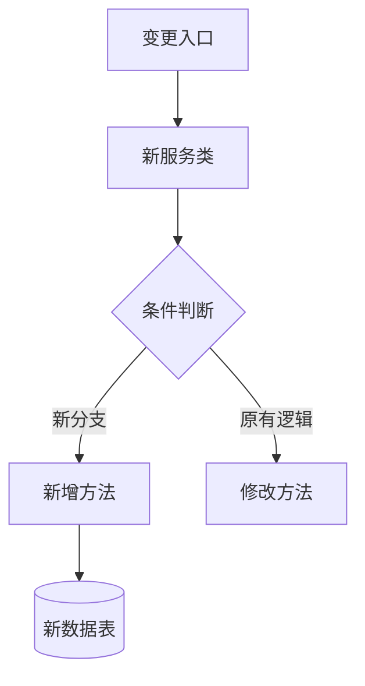

# {功能名称}技术方案 v{版本}

**文档状态**：待评审  
**版本号**：{yyyymmdd-x} 
**负责人**：{git_commiter}  
**最后更新**：{当前日期}
**参与方**：后端开发组、前端组、测试组

**代码分支**：{current_branch}  
**关联Commit**：{git_commit_hash}  
**变更范围**：{变更文件数}文件，{增删行数}行

## 1. 需求溯源
### 1.1 业务上下文
- 从代码注释/提交记录反推业务背景
- 归纳技术实现目标（不超过3项）
- 推导用户价值（避免假大空）

### 1.2 代码变更透视
```diff
{展示关键代码diff片段}

## 2. 系统影响范围

### 2.1 影响系统
| 系统模块 | 影响类型 | 负责人 |
|---------|---------|---------|
| 改动的模块 | 新增 | {git_commiter}  |
| 改动的模块 | 修改 | {git_commiter}  |
| 改动的模块 | 删除 | {git_commiter}  |

### 2.2 架构图


## 3. 技术方案

### 3.1 核心流程

```java
本次改动的核心代码
```

### 3.2 关键设计

1. **接口设计**：
   - 根据代码改动提供

2. **数据模型**：
   - 根据代码改动提供

3. **性能优化**：
   - 根据代码改动提供

4. **监控体系**：
   - 根据代码改动提供

## 4. 接口规范

### 4.1 接口名

**Path**: `{检索controller代码生成}`  
**Method**: POST  
**Content-Type**: application/json

#### 请求参数：
```json
{检索controller代码生成}
```

#### 响应参数：
```json
{检索controller代码生成}
```

## 5. 风险预案

### 5.1 已识别风险
| 风险点 | 影响程度 | 应对方案 |
|--------|----------|----------|
| 根据改动评估 | 高 | 根据改动评估 |
| 根据改动评估 | 高 | 根据改动评估 |
| 根据改动评估 | 高 | 根据改动评估 |

### 5.2 补充风险点
1. **数据完整性问题**
   - 风险：
   - 应对：

2. **业务类型扩展**
   - 风险：
   - 应对：

3. **性能问题**
   - 风险：
   - 应对：

4. **异常处理**
   - 风险：
   - 应对：
 
5. **历史数据兼容**
   - 风险：
   - 应对：

6. **灰度方案**
   - 风险：
   - 应对：

## 6. 测试要点

### 6.1 功能测试
根据代码改动提供

### 6.2 性能测试
评估是否需要

### 6.3 兼容性测试
默认需要：Android和IOS兼容

## 7. 排期计划

| 阶段 | 时间 | 交付物 |
|------|------|--------|
| 开发 | 3.21-3.23 | 核心功能开发 |
| 测试 | 3.24-3.25 | 测试用例执行 |
| 上线 | 3.26 | 生产环境部署 |
