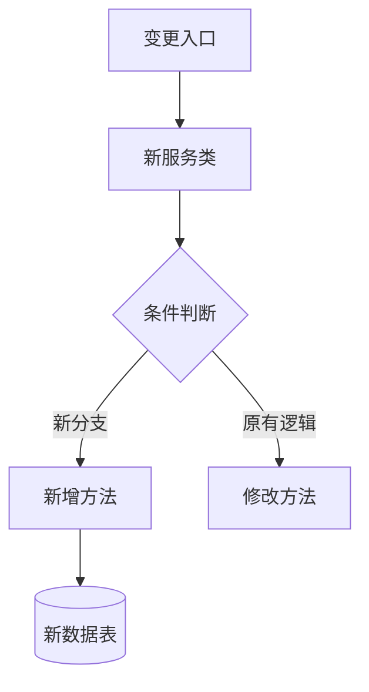

# {功能名称}技术方案 v{版本}

**文档状态**：待评审  
**版本号**：{yyyymmdd-x} 
**负责人**：{git_commiter}  
**最后更新**：{当前日期}
**参与方**：后端开发组、前端组、测试组

**代码分支**：{current_branch}  
**关联Commit**：{git_commit_hash}  
**变更范围**：{变更文件数}文件，{增删行数}行

## 1. 需求溯源
### 1.1 业务上下文
- 从代码注释/提交记录反推业务背景
- 归纳技术实现目标（不超过3项）
- 推导用户价值（避免假大空）

### 1.2 代码变更透视
```diff
{展示关键代码diff片段}
### 1.3 模块变更清单
| 类型 | 路径 | 文件 |

## 2. 系统影响范围

### 2.1 影响系统
| 系统模块 | 影响类型 | 负责人 |
|---------|---------|---------|
| 改动的模块 | 新增 | {git_commiter}  |
| 改动的模块 | 修改 | {git_commiter}  |
| 改动的模块 | 删除 | {git_commiter}  |

### 2.2 架构图


## 3. 技术方案

### 3.1 核心流程

```java
本次改动的核心代码
```

### 3.2 关键设计

1. **接口设计**：
   - 根据代码改动提供

2. **数据模型**：
   - 根据代码改动提供

3. **性能优化**：
   - 根据代码改动提供

4. **监控体系**：
   - 根据代码改动提供

## 4. 接口规范

### 4.1 接口名

**Path**: `{检索controller代码生成}`  
**Method**: POST  
**Content-Type**: application/json

#### 请求参数：
```json
{检索controller代码生成}
```

#### 响应参数：
```json
{检索controller代码生成}
```

## 5. 风险预案

### 5.1 已识别风险
| 风险点 | 影响程度 | 应对方案 |
|--------|----------|----------|
| 根据改动评估 | 高 | 根据改动评估 |
| 根据改动评估 | 高 | 根据改动评估 |
| 根据改动评估 | 高 | 根据改动评估 |

### 5.2 补充风险点
1. **数据完整性问题**
   - 风险：
   - 应对：

2. **业务类型扩展**
   - 风险：
   - 应对：

3. **性能问题**
   - 风险：
   - 应对：

4. **异常处理**
   - 风险：
   - 应对：
 
5. **历史数据兼容**
   - 风险：
   - 应对：

6. **灰度方案**
   - 风险：
   - 应对：

## 6. 测试要点

### 6.1 功能测试
根据代码改动提供

### 6.2 性能测试
评估是否需要

### 6.3 兼容性测试
默认需要：Android和IOS兼容

## 7. 排期计划

| 阶段       | 任务                | 预估人日 | Owner  | 计划完成时间 | 状态   | 备注                          |
|------------|---------------------|----------|--------|--------------|--------|-------------------------------|
| 设计       | 需求规格评审        | 2        | 产品经理 | 2025-04-01   | 未开始 | 需研发团队全员参与           |
|            | 技术方案设计        | 3        | 架构师  | 2025-04-04   | 未开始 | 输出系统架构图和技术方案文档 |
| 开发       | 需求拆解与排期      | 1        | 项目经理 | 2025-04-05   | 未开始 | 需确认任务优先级             |
|            | 后端模块1开发       | 5        | 张三   | 2025-04-12   | 未开始 | 基于Spring Cloud框架         |
|            | 后端模块2开发       | 4        | 李四   | 2025-04-10   | 未开始 | 依赖外部支付接口              |
|            | 前端模块1开发       | 6        | 王五   | 2025-04-15   | 未开始 | 使用React 18+版本            |
|            | 前端模块2开发       | 5        | 赵六   | 2025-04-13   | 未开始 | 需适配移动端                  |
|            | 公共接口开发        | 3        | 陈七   | 2025-04-09   | 未开始 | 定义统一API规范               |
|            | 数据库设计与初始化  | 2        | 数据库管理员 | 2025-04-07 | 未开始 | 需考虑分库分表设计           |
|            | 代码评审与重构      | 2        | 架构师  | 2025-04-16   | 未开始 | 重点检查性能和安全性         |
| 联调冒烟   | 接口联调测试        | 4        | 测试工程师 | 2025-04-19  | 未开始 | 使用Postman自动化测试脚本     |
|            | 冒烟测试            | 2        | 测试主管 | 2025-04-21   | 未开始 | 验证核心功能流程             |
| 测试       | 单元测试            | 3        | 开发工程师 | 2025-04-23  | 未开始 | 需覆盖80%以上代码路径        |
|            | 集成测试            | 5        | 测试团队 | 2025-04-28   | 未开始 | 模拟生产环境压力测试         |
|            | 系统测试            | 4        | 测试主管 | 2025-05-02   | 未开始 | 验证非功能需求（安全/性能）  |
| 上灰度     | 灰度环境部署        | 2        | DevOps团队 | 2025-05-04  | 未开始 | 需监控系统日志和报警         |
|            | 灰度测试            | 3        | 产品经理 | 2025-05-06   | 未开始 | 收集首批用户反馈             |
| 上生产     | 生产环境部署        | 1        | DevOps团队 | 2025-05-07  | 未开始 | 需提前备份数据               |
|            | 项目验收            | 1        | 项目经理 | 2025-05-08   | 未开始 | 需客户签署验收报告           |
