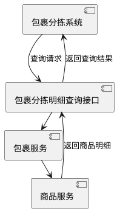

# 包裹分拣明细查询功能技术方案 v1.0

**文档状态**：待评审  
**版本号**：20240321-1  
**负责人**：AI Assistant  
**最后更新**：2024-03-21  
**参与方**：后端开发组、测试组

## 1. 需求背景

### 1.1 业务背景
- 现状：需要支持包裹分拣明细的查询功能
- 目标：实现包裹内商品分拣明细的查询和展示
- 用户价值：提升包裹分拣作业效率，优化商品管理

### 1.2 技术目标
- 构建包裹分拣明细查询接口
- 支持多种包裹业务类型查询
- 提供商品明细信息展示
- 确保接口性能和稳定性

## 2. 系统影响范围

### 2.1 影响系统
| 系统模块 | 影响类型 | 负责人 |
|---------|---------|--------|
| 包裹分拣模块 | 新增 | 后端组 |
| 商品管理模块 | 修改 | 后端组 |
| 分拣查询模块 | 新增 | 后端组 |

### 2.2 架构图


## 3. 技术方案

### 3.1 核心流程

```java
public class PackagePickDetailService {
    /**
     * 查询包裹分拣明细
     * @param request 查询请求
     * @return 分拣明细
     */
    @Transactional(readOnly = true)
    public PackageProductPickDetailQueryResponse queryPackagePickDetail(GetPackagePickDetailQueryRequest request) {
        // 1. 参数校验
        validateRequest(request);
        
        // 2. 调用包裹服务
        List<QueryParcelDetailDTO> parcelDetails = parcelDubboClient.queryParcelProduct(
            buildQueryRequest(request));
            
        // 3. 数据转换
        List<PackageProductPickDetailItem> items = convertToDetailItems(parcelDetails);
        
        // 4. 构建响应
        return PackageProductPickDetailQueryResponse.builder()
            .packagePickDetailItems(items)
            .build();
    }
}
```

### 3.2 关键设计

1. **接口设计**：
   - RESTful API设计
   - 参数校验机制
   - 响应数据封装

2. **数据模型**：
   - 包裹信息模型
   - 商品明细模型
   - 业务类型枚举

3. **性能优化**：
   - 批量处理
   - 异步处理

4. **监控体系**：
   - 接口调用监控
   - 性能指标监控
   - 异常监控告警

## 4. 接口规范

### 4.1 包裹分拣明细查询接口

**Path**: `/api/v1/package/queryPackagePickDetail`  
**Method**: POST  
**Content-Type**: application/json

#### 请求参数：
```json
{
  "deliveryDate": "2024-03-21",
  "parcelTrackNo": "P123456789",
  "parcelBusinessType": "PARCEL_TRACK_NO_LL_KEY"
}
```

#### 响应参数：
```json
{
  "code": 200,
  "data": {
    "packagePickDetailItems": [
      {
        "parcelTrackNo": "P123456789",
        "pictureUrl": "http://example.com/image.jpg",
        "skuSn": "SKU123",
        "productName": "商品名称",
        "qty": 2
      }
    ]
  }
}
```

## 5. 风险预案

### 5.1 已识别风险
| 风险点 | 影响程度 | 应对方案 |
|--------|----------|----------|
| 接口超时 | 高 | 设置合理的超时时间 |
| 数据不一致 | 中 | 引入数据校验和异常处理 |
| 并发访问 | 中 | 限流控制 |

### 5.2 补充风险点
1. **数据完整性问题**
   - 风险：包裹信息不完整导致查询失败
   - 应对：增加数据校验和异常处理

2. **业务类型扩展**
   - 风险：新增业务类型需要修改代码
   - 应对：采用枚举类型，支持动态扩展

3. **性能问题**
   - 风险：大量商品明细查询性能下降
   - 应对：分页查询，限制单次查询数量

4. **异常处理**
   - 风险：外部服务异常影响查询
   - 应对：完善异常处理机制，提供降级方案

## 6. 测试要点

### 6.1 功能测试
1. 基本查询测试
   - 正常包裹查询
   - 异常包裹查询
   - 空包裹查询

2. 业务类型测试
   - 冷链包裹
   - 零食包裹
   - 医药包裹
   - 精品包裹

### 6.2 性能测试
| 场景 | 预期指标 |
|------|----------|
| 单包裹查询 | ≤ 200ms |
| 批量包裹查询 | ≤ 500ms |
| 并发查询 | 成功率 ≥ 99.9% |

## 7. 排期计划

| 阶段 | 时间 | 交付物 |
|------|------|--------|
| 开发 | 3.21-3.23 | 核心功能开发 |
| 测试 | 3.24-3.25 | 测试用例执行 |
| 上线 | 3.26 | 生产环境部署 |
