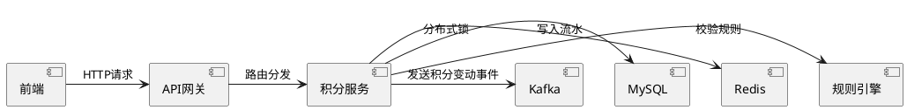

以下是一份详细专业的开发技术方案示例模板，满足前端、测试及后端开发人员的协作需求：

```markdown
# 用户积分系统技术方案 v1.2

**文档状态**：评审通过  
**版本号**：20240520-1  
**负责人**：周唯
**最后更新**：{now_time}  
**参与方**：前端组、后端组、测试组、DBA

---

## 目录
1. [需求背景](#1-需求背景)
2. [系统影响范围](#2-系统影响范围)
3. [技术方案](#3-技术方案)
4. [接口规范](#4-接口规范)
5. [数据库变更](#5-数据库变更)
6. [配置变更](#6-配置变更)
7. [测试要点](#7-测试要点)
8. [风险预案](#8-风险预案)
9. [排期计划](#9-排期计划)

---

## 1. 需求背景
### 1.1 业务背景
- 现状：现有积分发放策略单一（仅签到），需支持多场景积分发放
- 目标：建立标准化积分体系，支持活动积分、消费积分等多维度积分发放
- 用户价值：提升用户活跃度，增加消费转化率

### 1.2 技术目标
- 构建可扩展的积分发放框架
- 保证高并发下的积分发放准确性
- 实现积分流水可追溯
- 提供实时/准实时积分查询接口

---

## 2. 系统影响范围
### 2.1 影响系统
| 系统模块       | 影响类型 | 负责人   |
|----------------|----------|----------|
| 用户中心       | 修改     | 张后端   |
| 订单服务       | 新增调用 | 李后端   |
| 活动管理系统   | 新增     | 王前端   |
| 数据统计平台   | 新增     | 赵测试   |

### 2.2 架构图


---

## 3. 技术方案
### 3.1 核心流程
```java
// 积分发放核心逻辑
public class PointsService {
    /**
     * 发放积分入口
     * @param request 积分请求DTO
     * @return 发放结果
     */
    @Transactional(rollbackFor = Exception.class)
    public PointsGrantResult grantPoints(PointsGrantRequest request) {
        // 1. 参数校验
        validateRequest(request);
        
        // 2. 获取分布式锁
        Lock lock = redisLockManager.getLock(request.getUserId());
        try {
            if (lock.tryLock(3, TimeUnit.SECONDS)) {
                // 3. 规则校验
                RuleCheckResult checkResult = ruleEngine.check(request);
                
                // 4. 积分计算
                int points = calculator.calculate(checkResult);
                
                // 5. 记录流水
                recordTransaction(request, points);
                
                // 6. 更新总积分
                updateTotalPoints(request.getUserId(), points);
                
                // 7. 发送领域事件
                eventPublisher.publish(new PointsChangedEvent(...));
            }
        } finally {
            lock.unlock();
        }
    }
}
```

### 3.2 关键设计
1. **幂等控制**：基于requestId+userId+sourceType的复合唯一索引
2. **并发控制**：Redis分布式锁（Redisson实现）
3. **性能优化**：
   - 写操作：批量插入+异步更新总分
   - 读操作：Redis缓存+多级回源策略
4. **监控体系**：
   - Metrics埋点：TPS、成功率、耗时分布
   - 日志追踪：全链路TraceID

---

## 4. 接口规范
### 4.1 积分发放接口
**Path**: `/api/v3/points/grant`  
**Method**: POST  
**Content-Type**: application/json

#### 请求参数：
```json
{
  "requestId": "唯一请求ID（UUID）",
  "userId": 123456,
  "sourceType": "ORDER|ACTIVITY|SIGNIN",
  "sourceId": "订单ID/活动ID",
  "amount": 100,
  "expireTime": "2024-12-31 23:59:59"
}
```

#### 响应参数：
```json
{
  "code": 200,
  "data": {
    "grantId": "发放记录ID",
    "currentPoints": 1500,
    "expireTime": "2024-12-31 23:59:59"
  },
  "traceId": "acbdef123456"
}
```

#### 错误码规范：
| 状态码 | 含义               | 处理建议                 |
|--------|--------------------|--------------------------|
| 400    | 参数校验失败       | 检查请求格式             |
| 429    | 请求过于频繁       | 降低调用频率             |
| 500    | 系统错误           | 联系技术支持             |
| 1001   | 积分规则不匹配     | 检查业务规则配置         |

---

## 5. 数据库变更
### 5.1 新增表结构
```sql
CREATE TABLE `points_transaction` (
  `id` BIGINT(20) UNSIGNED NOT NULL AUTO_INCREMENT COMMENT '主键',
  `user_id` INT(11) NOT NULL COMMENT '用户ID',
  `points` INT(11) NOT NULL COMMENT '变动积分',
  `balance` INT(11) NOT NULL COMMENT '变更后余额',
  `source_type` VARCHAR(32) NOT NULL COMMENT '来源类型',
  `source_id` VARCHAR(64) NOT NULL COMMENT '来源ID',
  `request_id` VARCHAR(64) NOT NULL COMMENT '唯一请求ID',
  `created_at` DATETIME NOT NULL DEFAULT CURRENT_TIMESTAMP,
  `expired_at` DATETIME NOT NULL COMMENT '过期时间',
  PRIMARY KEY (`id`),
  UNIQUE KEY `uk_request` (`request_id`,`user_id`,`source_type`),
  KEY `idx_user` (`user_id`,`created_at`)
) ENGINE=InnoDB DEFAULT CHARSET=utf8mb4 COMMENT='积分流水表';
```

### 5.2 变更说明
1. 新增分表策略：按user_id % 64分表
2. 索引优化：覆盖主要查询场景（用户维度查询）
3. 数据归档：每月归档6个月前数据到历史库

---

## 6. 配置变更
### 6.1 Apollo配置
```properties
# 积分规则配置
points.rule.activity.enable = true
points.rule.activity.dailyLimit = 500

# 缓存配置
points.cache.ttl = 3600
points.cache.maxSize = 10000
```

---

## 7. 测试要点
### 7.1 功能测试
1. 正常场景：
   - 首次发放
   - 重复请求幂等
   - 不同来源类型发放

2. 异常场景：
   - 用户不存在
   - 单日上限验证
   - 积分过期处理

### 7.2 性能测试
| 场景           | 预期指标           |
|----------------|--------------------|
| 单接口QPS      | ≥ 3000            |
| 99分位延迟     | ≤ 200ms           |
| 万级并发       | 成功率 ≥ 99.99%   |

---

## 8. 风险预案
| 风险点         | 应对方案                          |
|----------------|-----------------------------------|
| 积分发放延迟   | 降级开关切异步模式                |
| 数据库压力大   | 启用读写分离+限流                 |
| 数据不一致     | 定时核对任务+自动修复             |

---

## 9. 排期计划
| 阶段       | 时间       | 交付物                 |
|------------|------------|------------------------|
| 开发       | 5.20-5.25  | 核心功能开发           |
| 联调       | 5.26-5.27  | 前后端联调完成         |
| 测试       | 5.28-5.30  | 测试报告               |
| 上线       | 6.1        | 生产环境部署           |
```
